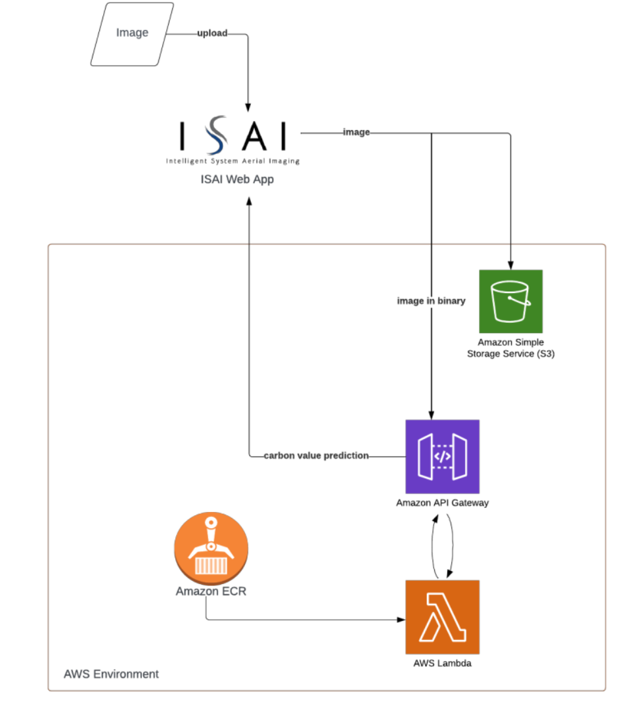

# ISAI Carbon Prediction 🌾

ISAI Carbon Prediction is a machine learning project focused on predicting carbon values from drone imagery, specifically using Near-Infrared (NIR) images. This research aims to leverage advanced image processing and machine learning techniques to accurately estimate carbon levels, which can be crucial for various environmental and agricultural applications.

## Project Overview 📄

This project is divided into 3 main parts, which are: 

- Development 
- Testing
- Deployment

## Development🛠️

The Development section is divided into 3 main parts:

| Main Part                  | Sub-Part             | Description                                                                 | Link                                                                                           |
|----------------------------|----------------------|-----------------------------------------------------------------------------|------------------------------------------------------------------------------------------------|
| Features Detection         |                      | Notebook for detecting features in images                                   | [Features Detection](https://github.com/christinandrea/isai-carbon-prediction-2024/blob/main/dev/features_detection.ipynb)            |
| Dataframe Restructure      |                      | Notebook for restructuring the dataframe                                    | [Dataframe Restructure](https://github.com/christinandrea/isai-carbon-prediction-2024/blob/main/dev/restructure.ipynb)               |
| Modelling Process          | FAST Datasets        | Contains notebooks for modelling using FAST features           | [FAST Datasets](https://github.com/christinandrea/isai-carbon-prediction-2024/tree/main/dev/fast-features)                          |
|                            | Height Only          | Modelling using height only dataset                                         | [Height Only](https://github.com/christinandrea/isai-carbon-prediction-2024/blob/main/dev/fast-features/fast_train_height_only.ipynb)                                    |
|                            | Height and Size      | Modelling using height and size dataset                                     | [Height and Size](https://github.com/christinandrea/isai-carbon-prediction-2024/blob/main/dev/fast-features/fast_training_height_and_size.ipynb)                                   |
|                            | Mix                  | Modelling using mix dataset                                                 | [Mix](https://github.com/christinandrea/isai-carbon-prediction-2024/blob/main/dev/fast-features/fast_train_mix_dataset.ipynb)                                   |
|                            | SIFT Datasets        | Contains notebooks for modelling using SIFT features           | [SIFT Datasets](https://github.com/christinandrea/isai-carbon-prediction-2024/tree/main/dev/sift-features)                          |
|                            | Height Only          | Modelling using height only dataset                                         | [Height Only](https://github.com/christinandrea/isai-carbon-prediction-2024/blob/main/dev/sift-features/sift_train_height_only.ipynb)                                    |
|                            | Height and Size      | Modelling using height and size dataset                                     | [Height and Size](https://github.com/christinandrea/isai-carbon-prediction-2024/blob/main/dev/sift-features/sift_training_height_and_size.ipynb)                                   |
|                            | Mix                  | Modelling using mix dataset                                                 | [Mix](https://github.com/christinandrea/isai-carbon-prediction-2024/blob/main/dev/sift-features/sift_train_mix_dataset.ipynb)                                   |

## Testing📊

The model was evaluated using the Mean Absolute Percentage Error (MAPE) and the R² score metrics. The evaluation results indicate that the proposed model achieved a MAPE of 0.10 (10% error) and an R² score of 0.75. These results suggest that the model performs well.

This model is proven to succeed in real data prediction through a [comparison test](https://github.com/christinandrea/isai-carbon-prediction-2024/tree/main/test) between real and predicted carbon values. The model shows the least error at 25m height, with a result of 6.77%.

## Deployment🌐

The objective is to implement the proposed model in a real-world application, utilising a serverless architecture with Amazon Web Services (AWS). The core AWS components employed for this purpose are AWS Lambda for the inference process and Amazon API Gateway for the endpoint.

## Technology Stack💻

This project utilised the following technology stack:

- Programming language : Python
- Cloud service : Amazon Web Services
- Libraries : 
    - Tensorflow
    - Scikit-learn
    - Pandas
    - Numpy

